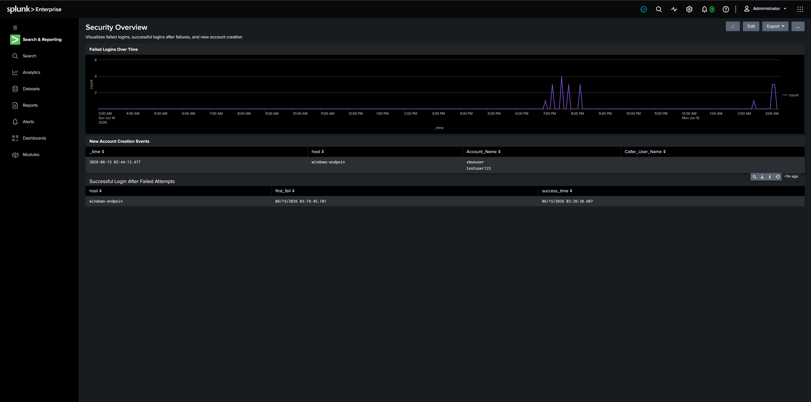

# Splunk SIEM Home Lab

A home lab built to learn how a SIEM works in practice, from log collection through to detection and alerting. Two virtual machines simulate a small environment, with Splunk Enterprise acting as the central log collector and a Windows endpoint forwarding security events to it.

## Overview

This lab covers the full pipeline a SOC analyst works with day to day: getting logs into a central system, writing searches to find specific activity, building detections that run automatically, and visualizing everything on a dashboard.

## Environment

Two VirtualBox virtual machines on a NAT Network so they can communicate with each other.

**splunk-server**: Ubuntu Server running Splunk Enterprise 10.4.0. Acts as the indexer, receiving and storing logs.

**windows-endpoint**: Windows 10 running Splunk Universal Forwarder. Sends Windows Event Logs (Security, System, Application) to the indexer over port 9997.

## Detections

### 1. Multiple Failed Logins
Watches for 3 or more failed logon events (Event ID 4625) from the same host within 15 minutes. A possible sign of a brute force attempt or a locked out user. Severity: Medium.

```
index=main EventCode=4625
| stats count by host, ComputerName
| where count >= 3
```

### 2. Successful Login After Failed Attempts
Looks for a successful logon (Event ID 4624) that follows failed logon attempts (Event ID 4625) on the same host within 15 minutes. A stronger indicator that someone may have guessed or cracked a password and gotten in. Severity: High.

```
index=main (EventCode=4625 OR EventCode=4624) host=windows-endpoin
| stats earliest(eval(if(EventCode=4625, _time, null()))) as first_fail, latest(eval(if(EventCode=4624, _time, null()))) as success_time by host
| where isnotnull(first_fail) AND isnotnull(success_time) AND success_time > first_fail AND (success_time - first_fail) <= 900
```

### 3. New User Account Creation
Tracks new local account creation (Event ID 4720), including who created the account and what it was named. Not inherently malicious, but a well known persistence technique used by attackers after a compromise, so it is tracked for visibility. Severity: Medium-Low.

```
index=main EventCode=4720
| table _time, host, ComputerName, Account_Name, Caller_User_Name
```

## Dashboard

A Security Overview dashboard brings all three detections into a single view: a timechart of failed logins, a table of new account creation events, and a table showing the success after failure correlation.



## Key Challenges and Fixes

Getting the Universal Forwarder connected required local forwarder credentials created during install, not the Splunk Enterprise admin account.

Connecting the forwarder and configuring what it sends are two separate steps. The forwarder was connected but sending nothing until inputs.conf was manually created to monitor the Windows Event Logs.

A stats based correlation across all event history can collapse unrelated events into a single row, since stats by host groups everything together regardless of when it happened. Isolated testing and a narrower time range were needed to validate the success after failure detection.

## What This Covers

Setting up log forwarding from an endpoint to a central indexer (TCP port 9997).

Searching and filtering Windows Event Logs by Event ID.

Building threshold based detections (failed login counts).

Correlating multiple event types over time (failed then successful login).

Building visibility focused alerts for events that are not inherently malicious but are useful to track (account creation).

Building a dashboard to bring multiple detections into one view.

Cron syntax for scheduling recurring searches.

## Screenshots

See the screenshots folder for the full setup walkthrough, from initial VM installation through to the finished dashboard.

## Detailed Progress Log

See [docs/progress.md](docs/progress.md) for a full chronological writeup of every step, including problems encountered and how they were resolved.
